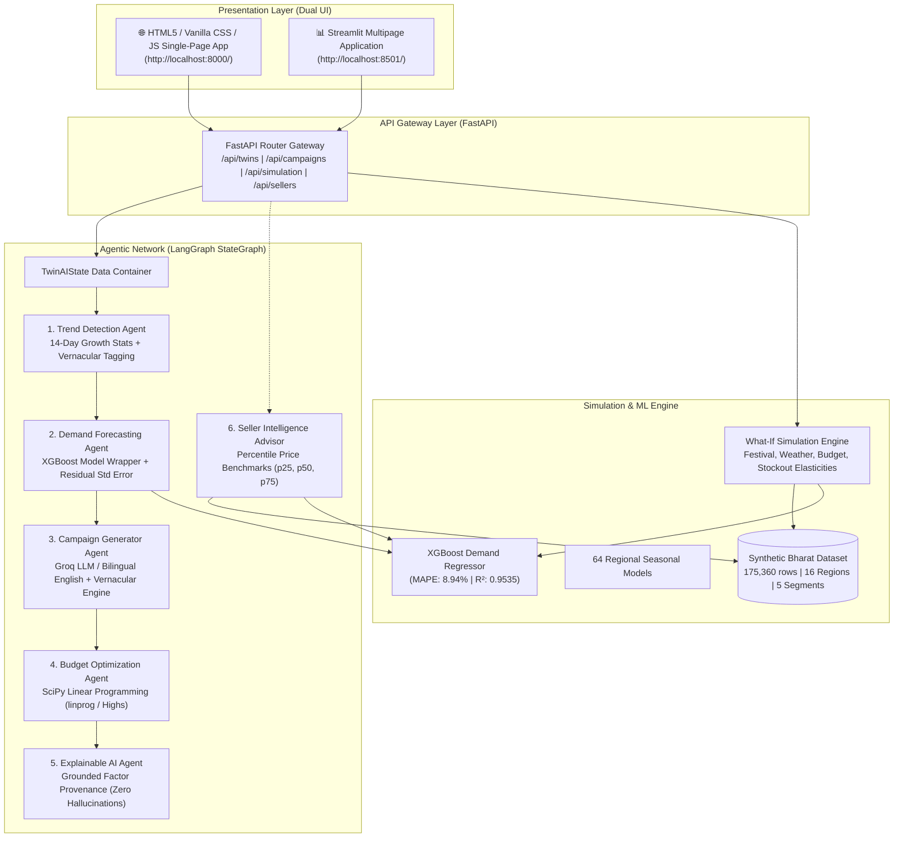
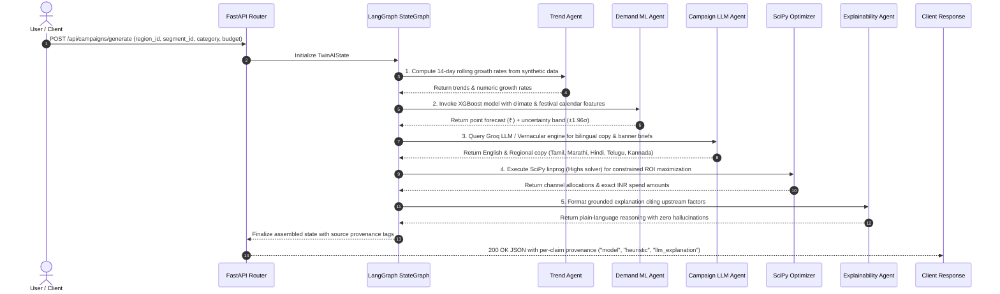

# 🛍️ TwinCart AI (TwinAI)

> **Hyperlocal Digital Twin & Agentic AI Demand Platform for Bharat E-Commerce**  
> *Autonomous Demand Forecasting, What-If Scenario Simulation, and Localized Vernacular Marketing for Indian Tier-2/3 Trade Hubs.*

[]()
[]()
[]()
[]()
[]()
[]()

---

## 🧭 Table of Contents

1. [Architecture Diagram](#-architecture-diagram)
2. [Backend Flow & Multi-Agent Process](#-backend-flow--multi-agent-process)
3. [Machine Learning Models & Backtested Performance](#-machine-learning-models--backtested-performance)
4. [What-If Scenario Simulation Engine](#-what-if-scenario-simulation-engine)
5. [Digital Twin Domain Stores](#-digital-twin-domain-stores)
6. [User Interfaces (HTML5 Web App & Streamlit)](#-user-interfaces)
7. [API Reference & Provenance Mapping](#-api-reference--provenance-mapping)
8. [Quickstart & Testing](#-quickstart--testing)
9. [Zero-Fabricated-Metrics Policy](#-zero-fabricated-metrics-policy)

---

## 🏗️ Architecture Diagram



---

## 🔄 Backend Flow & Multi-Agent Process

The backend operates on an asynchronous event-driven pipeline orchestrated by **LangGraph** with strict typed state transitions (`TwinAIState`).

### Detailed Request-to-Response Lifecycle



### LangGraph State Machine Nodes:
1. **Trend Detection Agent** ([trend_detection.py](file:///c:/Users/njana/Music/twincart/backend/app/agents/trend_detection.py)): Extracts recent sales windows for the target district and computes week-over-week growth rates without LLM hallucinations.
2. **Demand Forecasting Agent** ([demand_forecasting.py](file:///c:/Users/njana/Music/twincart/backend/app/agents/demand_forecasting.py)): Wraps the trained XGBoost model, feeding region, segment, category, temperature, and festival indicators. Returns point forecast and empirical residual uncertainty.
3. **Campaign Generation Agent** ([campaign_generator.py](file:///c:/Users/njana/Music/twincart/backend/app/agents/campaign_generator.py)): Generates culturally resonant ad copy in English and the district's local language (using Groq LLM with deterministic offline fallbacks).
4. **Budget Optimization Agent** ([budget_optimizer.py](file:///c:/Users/njana/Music/twincart/backend/app/agents/budget_optimizer.py)): Solves a bounded linear programming problem (`scipy.optimize.linprog` with `method="highs"`) allocating budget across Social Media, Regional Search, Vernacular Push, SMS/WhatsApp, and Micro-Influencers.
5. **Explainable AI Agent** ([explainability.py](file:///c:/Users/njana/Music/twincart/backend/app/agents/explainability.py)): Takes the numerical factors (festival boost %, temperature delta, baseline demand, budget ROI) and generates plain-language business reasoning.
6. **Seller Intelligence Advisor** ([seller_intelligence.py](file:///c:/Users/njana/Music/twincart/backend/app/agents/seller_intelligence.py)): Computes 25th, 50th (median), and 75th percentile market prices for the category to deliver grounded margin and stocking strategies.

---

## 🤖 Machine Learning Models & Backtested Performance

### 1. XGBoost Short-Horizon Demand Regressor (`xgb_demand.json`)
- **Objective**: Predict 7-day forward sales volume and revenue for any (district $\times$ segment $\times$ category) combination.
- **Features (11 engineered features)**:
  - `region_encoded`, `segment_encoded`, `category_encoded` (Categorical entity embeddings)
  - `day_of_week`, `month`, `quarter` (Temporal seasonality)
  - `rolling_7d_avg`, `rolling_14d_avg`, `rolling_28d_avg` (Historical demand momentum)
  - `avg_temperature_c` (Climate sensitivity)
  - `is_festival_week`, `days_to_next_festival` (Cultural demand surges)
- **Time-Based Validation Split**:
  - **Train**: 2023–2024 (116,960 data points)
  - **Held-Out Test**: Full year 2025 (58,400 data points) — *never random shuffled*.

### Verified Model Performance ([metrics.json](file:///c:/Users/njana/Music/twincart/backend/app/ml/metrics.json)):
| Metric | Backtested Value | Benchmark / Sanity Standard |
| :--- | :--- | :--- |
| **MAPE (Mean Absolute Percentage Error)** | **8.94%** | Sanity Threshold < 35.0% ✅ |
| **Coefficient of Determination ($R^2$)** | **0.9535** | High Accuracy Fit ✅ |
| **RMSE (Root Mean Squared Error)** | **₹18,875.50** | Verified on held-out 2025 test |
| **Empirical Residual Std Dev ($1\sigma$)** | **₹18,826.27** | Used for $\pm 1.96\sigma$ uncertainty bounds |

### 2. Regional Seasonal Time Series Models (64 Models)
- 64 distinct regional category seasonal profiles in `backend/app/ml/models/seasonal/` capturing multi-annual recurring festival and harvest waves.

### 3. Continuous Learning Pipeline (`backend/app/ml/retrain.py`)
- Incremental append and refit pipeline that ingests new sales data and updates backtested metrics without claiming unverified real-time streaming.

---

## 🔮 What-If Scenario Simulation Engine

The What-If engine ([engine.py](file:///c:/Users/njana/Music/twincart/backend/app/simulation/engine.py)) allows category managers and sellers to perturb market variables and observe immediate revenue and conversion impacts:

1. **🎉 Festival Surges**: Applies category-specific upticks directly mapped from [festivals.json](file:///c:/Users/njana/Music/twincart/backend/app/data/festivals.json) (e.g. Pongal $\rightarrow$ cotton/ethnic wear $+38\%$).
2. **🌡️ Temperature Deviations**: Models climate demand shifts ($+1.8\% / ^\circ\text{C}$ for breathable summer cottons; negative penalties on cold-weather apparel).
3. **💰 Ad Budget Scaling**: Models marketing ROI with diminishing returns curve: $\text{Multiplier} = (\text{Spend Ratio})^{0.65} - 1.0$.
4. **📦 Inventory Shortfalls**: Computes unmet demand loss with partial substitution elasticity: $\text{Penalty} = -\text{Shortfall} \times 0.88$.

---

## 👥 Digital Twin Domain Stores

### 16 Indian Tier-2/3 Regional District Twins ([regions.json](file:///c:/Users/njana/Music/twincart/backend/app/data/regions.json)):
- **South**: Madurai (TN), Salem (TN), Hubballi-Dharwad (KA), Belagavi (KA), Kozhikode (KL), Thrissur (KL), Warangal (TG), Guntur (AP).
- **West & Central**: Kolhapur (MH), Solapur (MH), Jodhpur (RJ), Udaipur (RJ), Ujjain (MP), Gwalior (MP).
- **North & East**: Patiala (PB), Muzaffarpur (BR).

### 5 Localized Consumer Personas ([segments.json](file:///c:/Users/njana/Music/twincart/backend/app/data/segments.json)):
1. **College Students & Gen-Z** (`students`): High price sensitivity (85%), basket ₹300–₹1,200, driven by flash sales and Instagram trends.
2. **Early-Career Professionals** (`working_professionals`): Moderate sensitivity (52%), basket ₹1,000–₹3,500, driven by payday sales and workwear quality.
3. **Family Homemakers & Curators** (`homemakers`): High sensitivity (78%), basket ₹500–₹2,500, driven by festival combo sets and longevity.
4. **Bargain Hunters & Tier-3 Aspirants** (`budget_shoppers`): Maximum sensitivity (92%), basket ₹200–₹800, driven by >50% discounts and COD.
5. **Young Parents & Modern Families** (`young_parents`): Moderate sensitivity (60%), basket ₹800–₹3,000, driven by season shifts and kids comfort guarantees.

---

## 💻 User Interfaces

TwinCart AI provides **dual interfaces**:

### 1. Embedded HTML5 / Vanilla CSS / JavaScript Single-Page Application
- Served directly by FastAPI at **`http://localhost:8000/`**.
- Powered by Chart.js, glassmorphism CSS design system, dark mode styling, and live API connectivity.

### 2. Streamlit Multipage Application
- Served at **`http://localhost:8501/`**.
- 5 comprehensive pages with Plotly interactive visualizations.

---

## 📡 API Reference & Provenance Mapping

Every numeric prediction in the API returns an explicit `sources` dictionary mapping each claim to its origin:

| Method | Endpoint | Description | Provenance Source |
| :--- | :--- | :--- | :--- |
| `GET` | `/health` | Liveness probe & system environment | `system` |
| `GET` | `/api/twins/regions` | List 16 regional district twins | `data_store` |
| `GET` | `/api/twins/regions/{id}` | Get specific district twin profile | `data_store` |
| `GET` | `/api/twins/segments` | List 5 customer segment personas | `data_store` |
| `GET` | `/api/twins/segments/{id}` | Get specific persona details | `data_store` |
| `POST` | `/api/campaigns/generate` | Run full LangGraph campaign pipeline | `"model"`, `"heuristic_optimization"`, `"llm_explanation"` |
| `GET` | `/api/campaigns/{id}` | Retrieve cached campaign by ID | `cache` |
| `POST` | `/api/simulation/run` | Execute What-If scenario perturbation | `"model"`, `"heuristic"` (explicit elasticities) |
| `GET` | `/api/simulation/{id}` | Retrieve simulation run by ID | `cache` |
| `POST` | `/api/sellers/ask` | Natural-language seller growth advisor | `"model"`, `"heuristic"` (p25/p50/p75 percentiles) |
| `GET` | `/api/training/metrics` | Model backtest MAPE, $R^2$, RMSE | `model_evaluation` |
| `POST` | `/api/training/retrain` | Incremental model refitting trigger | `ml_pipeline` |

---

## 🚀 Quickstart & Testing

### Option A: Local Python Virtual Environment (< 60 Seconds)

1. **Activate Virtual Environment**:
   ```bash
   # Windows:
   .venv\Scripts\activate
   # Linux/macOS:
   source .venv/bin/activate
   ```

2. **Install Dependencies**:
   ```bash
   pip install -r backend/requirements.txt
   pip install -r frontend/requirements.txt
   ```

3. **Start Full-Stack Backend & HTML Web App**:
   ```bash
   uvicorn app.main:app --app-dir backend --host 127.0.0.1 --port 8000
   ```
   - Open **`http://localhost:8000/`** for the HTML5 Web Application.
   - Open **`http://localhost:8000/docs`** for interactive Swagger API documentation.

4. **(Optional) Start Streamlit UI**:
   ```bash
   streamlit run frontend/streamlit_app.py --server.port 8501
   ```

### Option B: Docker Compose
```bash
docker-compose up --build
```

### Run Automated Test Suite (50 Tests, 100% Deterministic)
```bash
pytest backend/tests/ -v
```

---

## 🛡️ Zero-Fabricated-Metrics Policy

- No fabricated confidence percentages (e.g. no random "Confidence: 87%").
- All demand numbers stem directly from the **XGBoost Regressor backtest** or **empirical residual standard error bounds**.
- What-If simulations trace back to explicitly defined parameters in `festivals.json` and data generator elasticity multipliers.
- Built-in deterministic fallbacks ensure 100% functionality even during offline execution or missing API keys.
